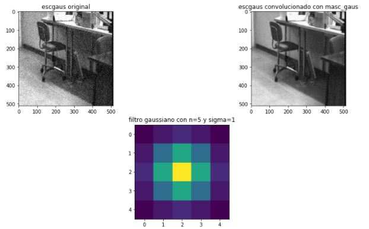
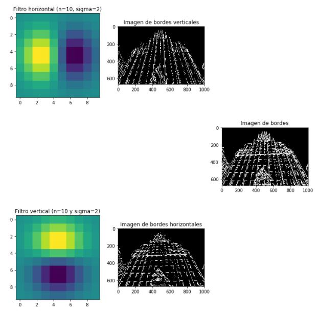
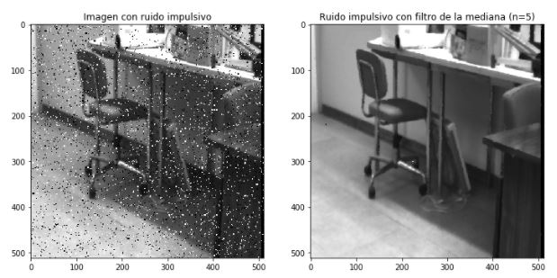
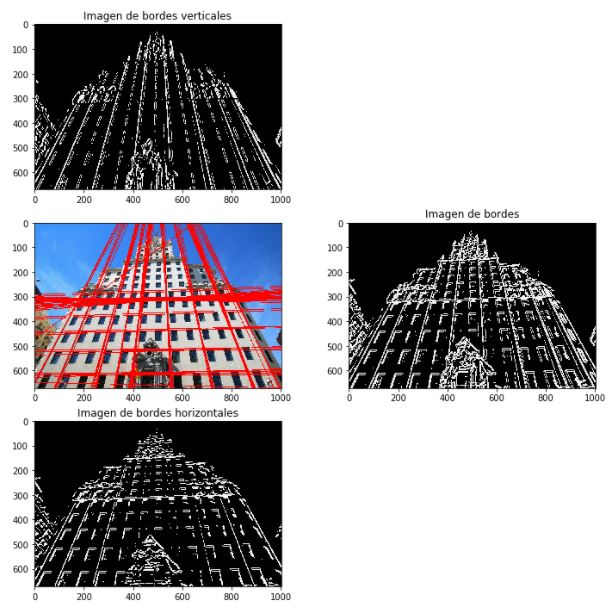
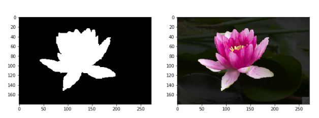

# Digital Image Processing

In this directory, particularly in [this file](https://github.com/themrcesi/ComputerVision/blob/main/Pr%C3%A1ctica1/Practica1-2020.ipynb), you can see the exercises from the first assignment of the course. 

## Examples

You can observe some examples below.

### Gaussian filter

We can observe how a gaussian filter can remove the gaussian noise from an image.

### Gradient filter

We can observe how a gradient filter is able to obtain the bordes of an image.

### Median filter

We can observe how a median filter can remove the impulsive noise from an image.

### Hough Transform

We can observe the application of the Hough Transform in order to obtain the straight lines of an image.

### Interactive image segmentation using graph cuts

We can observe an example of how powerful the interactive image segmentation algorithm is.

