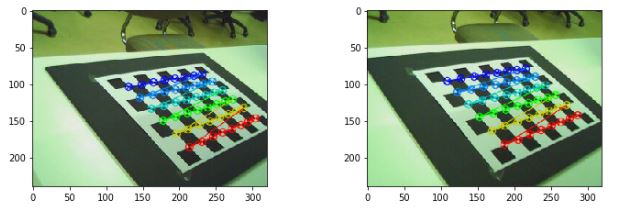
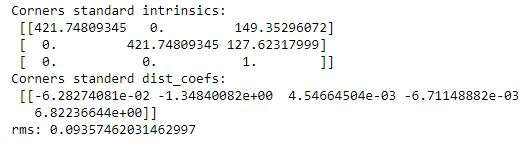
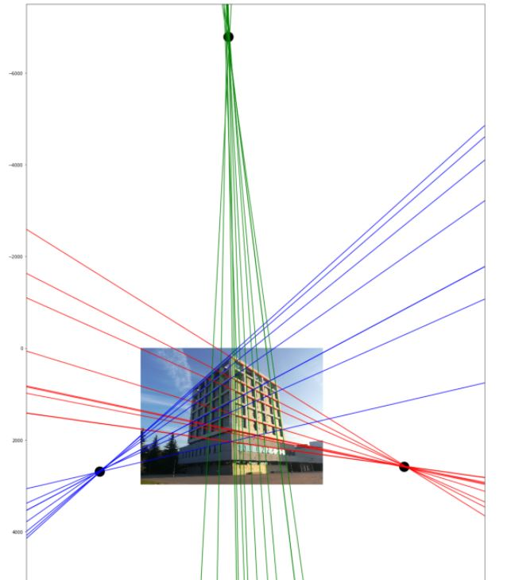

# Camera Calibration

In this directory, particularly in [this file](https://github.com/themrcesi/ComputerVision/blob/main/Pr%C3%A1ctica2/PracticaCalib2020.ipynb), you can see the exercises from the second assignment of the course. 

---

We can divide the exercises in two main sections: calibration using two images and calibration using a single image.

## Calibration using two images

## Calibration using a single image

