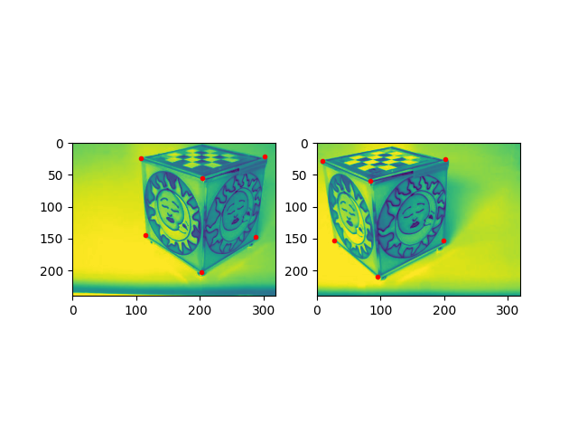
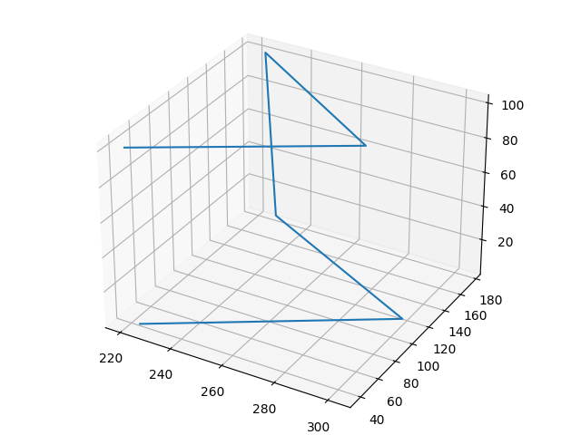
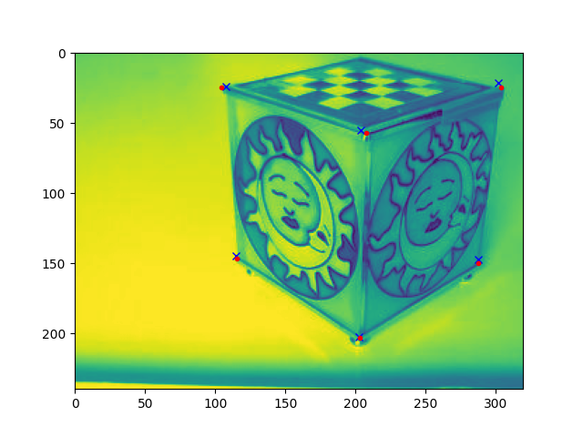
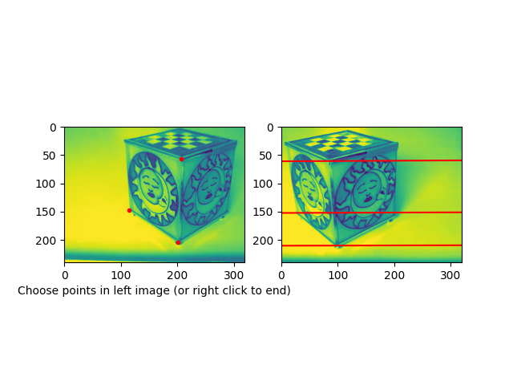
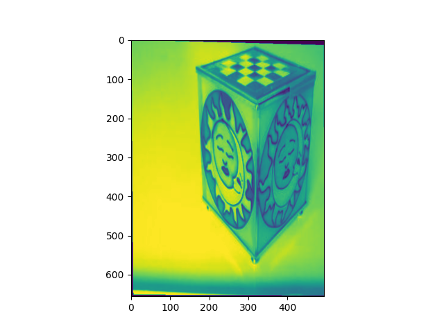
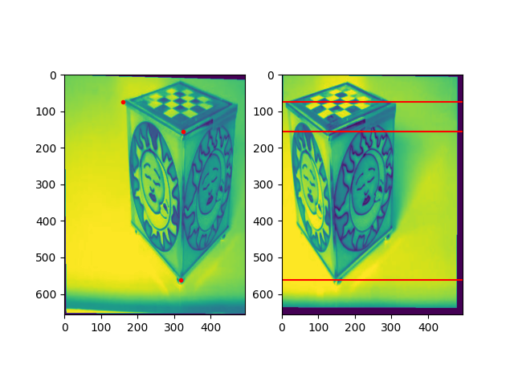

# Stereo Vision: Image reconstruction
In this directory, particularly in [this file](https://github.com/themrcesi/ComputerVision/blob/main/Pr%C3%A1ctica3/PracticaStereo.ipynb), you can see the exercises from the third assignment of the course. 

---

## Examples

We can see below some examples of the exercises of this assignment.

### Ask for similar points

### Points reconstruction

### Reprojections

### Epipolar lines

### Image rectification

### Epipolar lines rectified images

